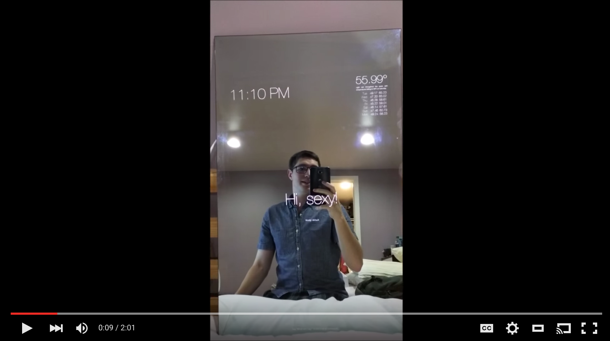

# Introduction

The smart-mirror was inspired by [HomeMirror](https://github.com/HannahMitt/HomeMirror) and Michael Teeuw's [Magic Mirror](http://michaelteeuw.nl/tagged/magicmirror). It was originally created in a weekend and is now maintained by a growing community of contributors and enthusiasts. 

The smart-mirror is voice controlled, integrates with a growing number of services, and can control your lights :)

Video Demo: [See it in action](https://youtu.be/PDIbhV8Nvq8)

Starting from scratch? No problem. Head on over to the [Supported Hardware](docs/supported_hardware.md) section to get started.

If you encounter problems along the way check out the [Troubleshooting](docs/troubleshooting.md) section or join us in the [gitter chat](https://gitter.im/evancohen/smart-mirror).

Should you find any issues or bugs please [file them on GitHub](https://github.com/evancohen/smart-mirror/issues/new).