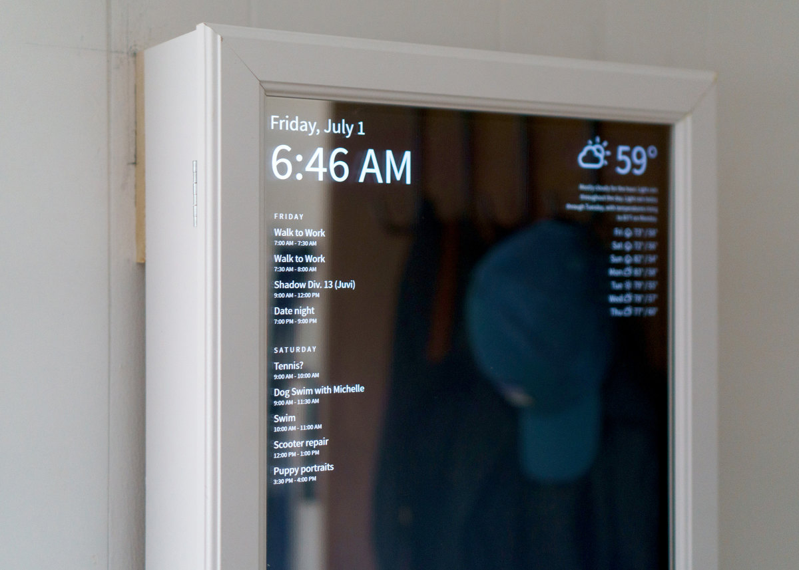
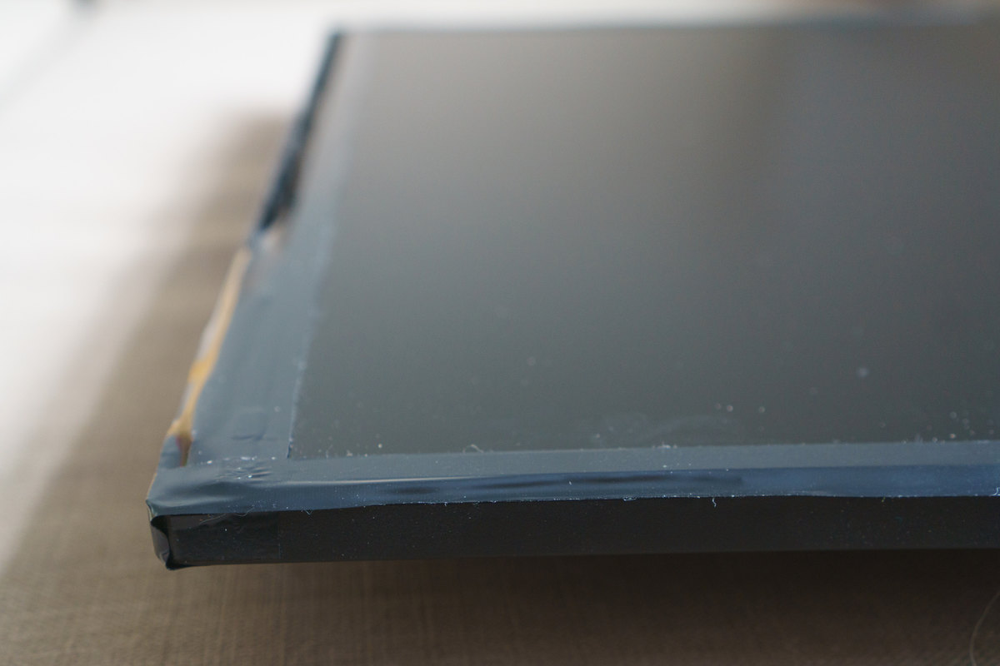
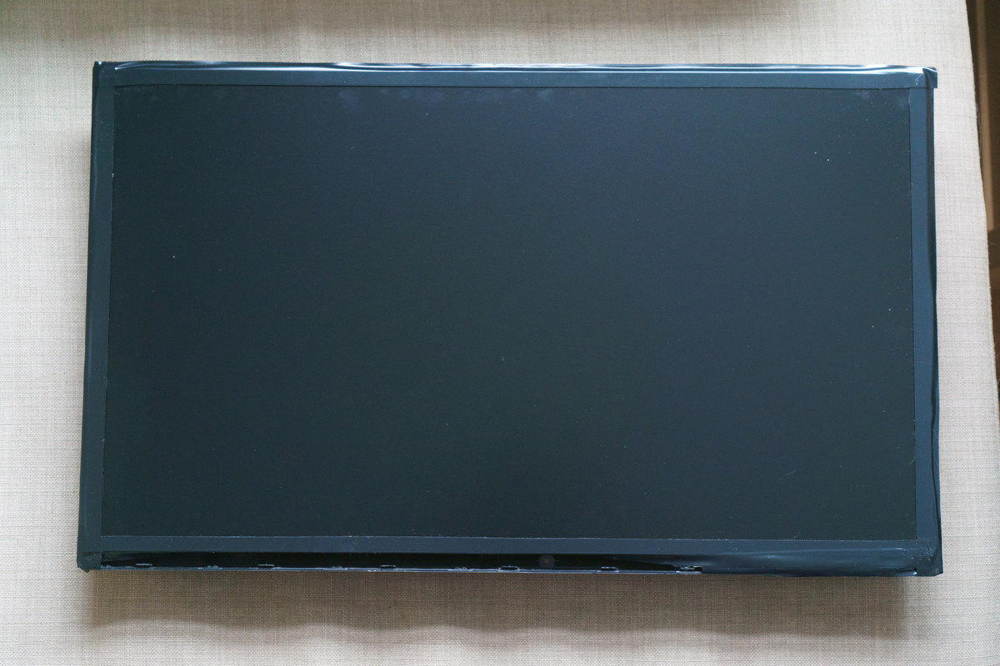
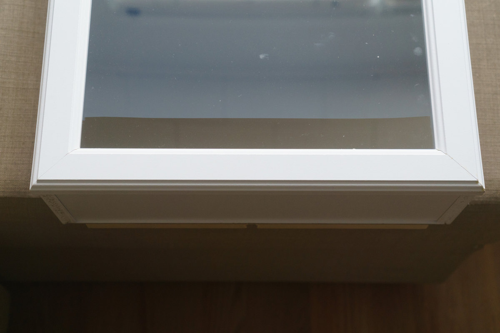
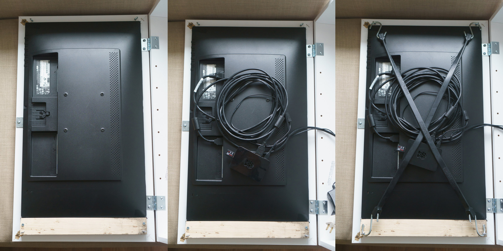
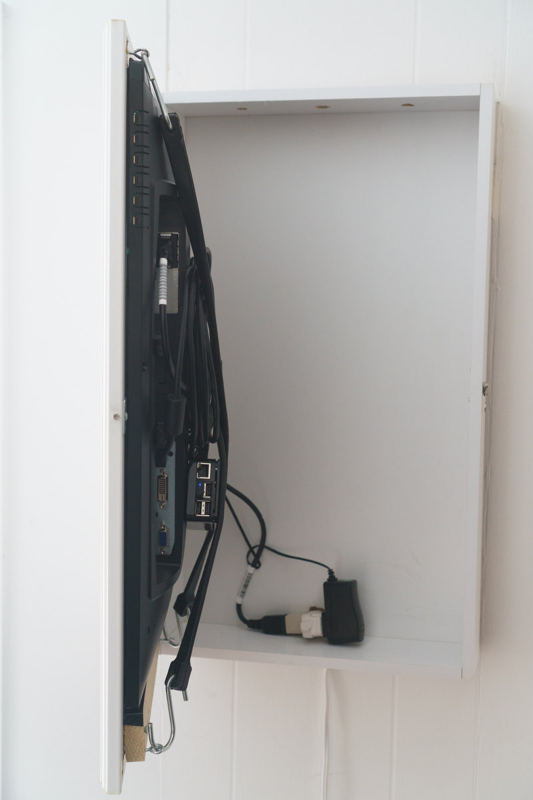

# Hardware

To build a smart-mirror, you will need at least three things: 
- A two-way mirror
- A monitor
- Something to run the `smart-mirror` application. (Most people use a Raspberry Pi)

In order to use the voice control features of your smart-mirror, you will also need a USB microphone (or USB Webcam w/ microphone).

In addition, `smart-mirror` can control a Phillips Hue lighting system.

Next Step: [Installation](installation.md)

See below for a quick guide to building a smart-mirror using mostly off-the-shelf parts:

# Building a smart-mirror
Guide contributed by [Joel Hawksley](http://www.hawksley.org)

### Parts list

| Item | Price (incl. shipping) |
| -- | -- |
| [Two-Way Acrylic Mirror - 23-9/16" x 13"](http://www.tapplastics.com/product/plastics/cut_to_size_plastic/two_way_mirrored_acrylic/558) | $82.65 |
| [HP 24uh 24" LED Monitor](https://www.amazon.com/gp/product/B00SFB13UC)  | $129.99 |
| [Glacier Bay Medicine Cabinet](http://www.homedepot.com/p/Glacier-Bay-15-1-4-in-x-26-in-Surface-Mount-Framed-Mirrored-Swing-Door-Medicine-Cabinet-in-White-S1627-12-B/100576352) | $34.97 |
| [Keeper 24" Rubber Strap, 2 Pack](https://www.amazon.com/Keeper-06225-EPDM-Rubber-Strap/dp/B001DQDBSS) | $3.96 |
| 4 x Eye hooks | $0.25 |
| Misc. Cut Lumber | $10.00 |
| Black Electrical Tape | $0.99 |
| (Optional) Door Latch | $3.99 |
| **Total** | $266.80 |

### Preparing the monitor
I specifically chose the HP 24uh monitor due to its low cost, ability to fit in the pre-built medicine cabinet, and its downward-facing ports. It also turned out to be pretty easy to remove the monitor's bezel, without even having to open the casing.

First, remove the single screw on the back of the monitor. Then, pop off the bezel using a flat-head screwdriver or similar implement.

Next, cover the exposed display frame with black electrical tape. The monitor will now be able to sit flush with the mirror.

The monitor, ready for installation in the cabinet:

### Preparing the cabinet
First, disassemble the door of the medicine cabinet, removing the mirror from the frame. The staples holding the frame together can be pulled out with needle-nose pliers. 

Replace the mirror with the two-way acrylic and re-assemble the frame. (I was able to re-use the staples, but added some wood glue to be safe)

Next, tape over the bottom 1 3/4" of the back of the acrylic with electrical tape, masking off the area not covered by the monitor.

Add a strip of wood at the bottom of the frame to support the monitor. Attach an eye-hook to each end of the strip. Attach an eye hook in the top corners of the frame.

Also, you might want to drill ventilation holes. I added three to the top of the cabinet:

Due to the tight fit of the monitor, I was not able to use the magnetic closure that came with the cabinet. Instead, I installed a small latch:

# Final assembly
Place the monitor on the frame, connect cables/Raspberry Pi, and attach the rubber straps.

The final assembly, in profile:

### Mounting (Optional)

Due to the somewhat heavy weight of the final assembly, I had wood cleats cut at my local hardware store, allowing me to anchor the mirror securely to the wall.

That's it! Depending on your install location, you'll need to run some sort of power to the mirror. Enjoy your smart-mirror!

Next Step: [Installation](installation.md)